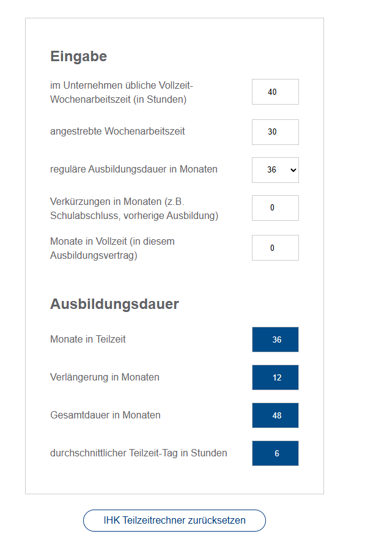
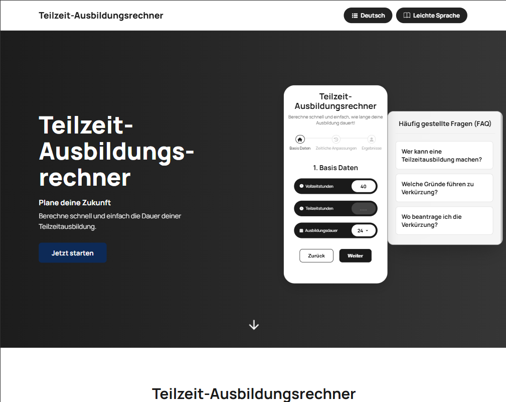
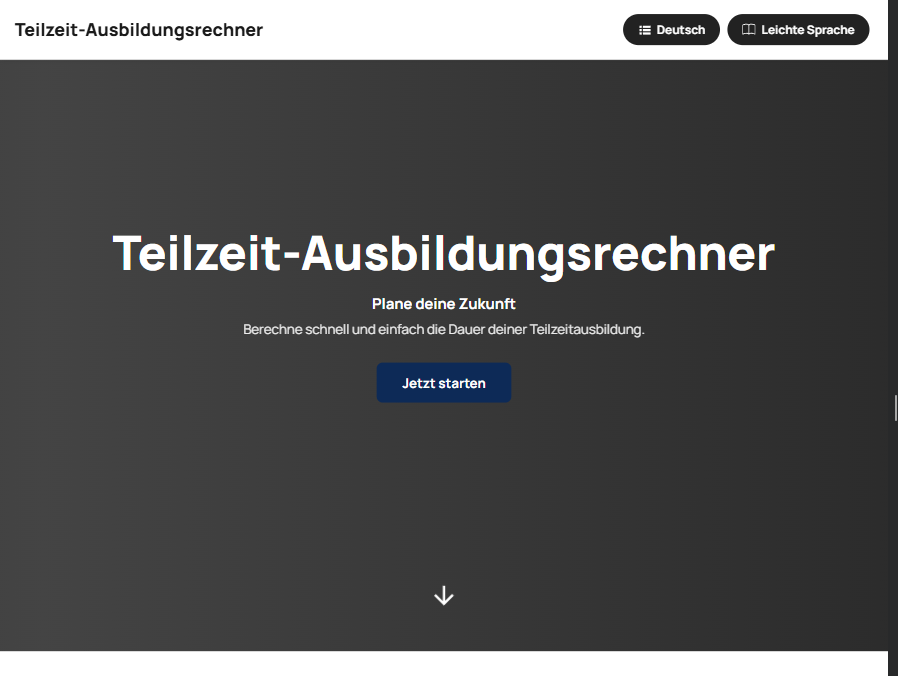
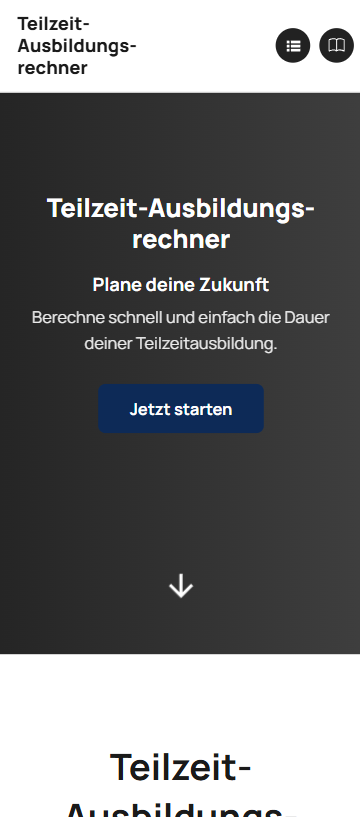
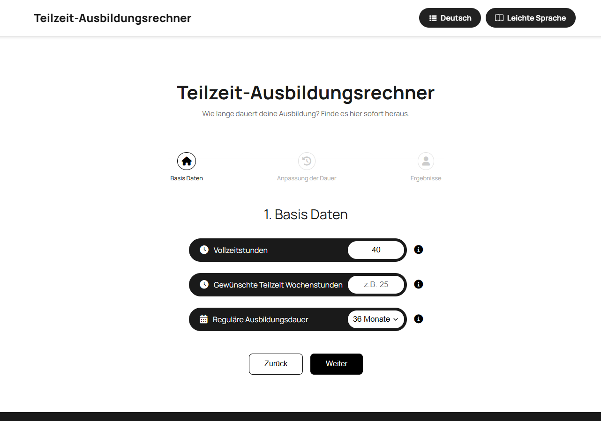
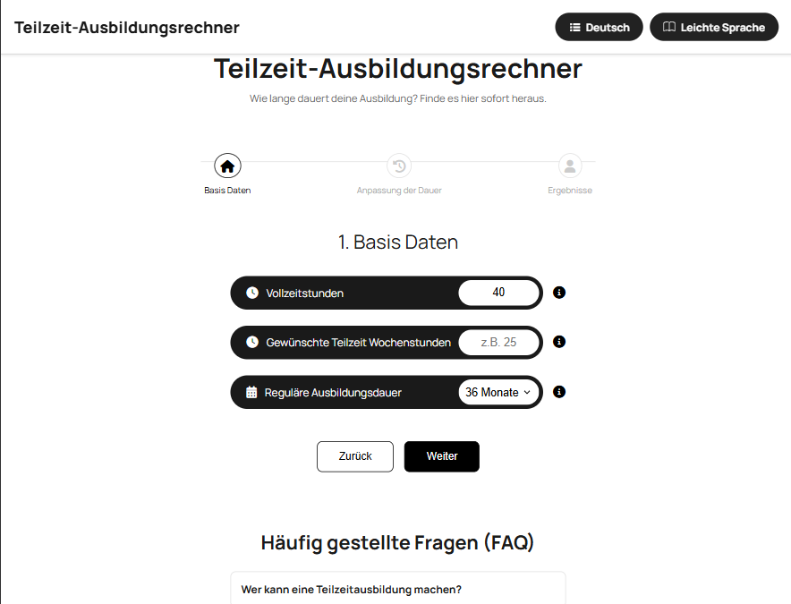
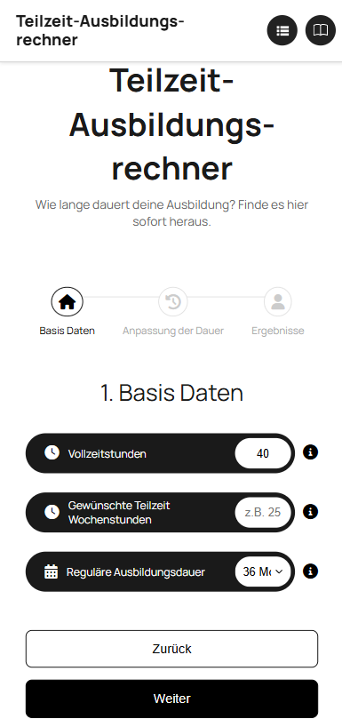
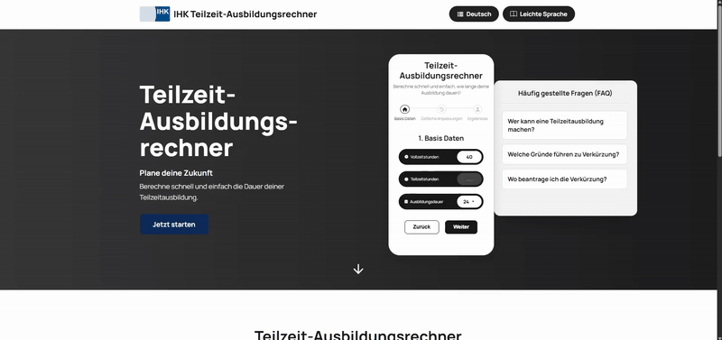

# 🧮 Teilzeitausbildungsrechner

📚 **Laborprojekt** im Kurs *Softwareentwicklung*  
🎓 Studiengang: Software Engineering  

---

## 📘 Projektübersicht

Dieses Projekt ist eine Überarbeitung des bestehenden **IHK-Teilzeitausbildungsrechners**.  
Ziel ist es, die **Benutzerfreundlichkeit**, **Barrierefreiheit** und **Verständlichkeit** zu verbessern – insbesondere für Nutzer:innen, die den bisherigen Rechner als kompliziert und unübersichtlich empfinden.

Das Projekt wird als **Gruppenarbeit** im Rahmen des Labor-Kurses Softwareentwicklung durchgeführt.  
**Hauptentwickler:** Abdulbaki Cakir

---

### 🧩 Aktueller Teilzeitausbildungsrechner der IHK

| Vorschau |
|----------|
|  |

---

## 🎯 Ziele

- **Frontend verbessern:** übersichtliches, modernes Design, klare Eingabefelder  
- **Formulierungen vereinfachen:** verständliche Texte für alle Nutzer:innen  
- **Barrierefreie Nutzung:** Übersetzung in mehrere Sprachen, optionale leichte Sprache  
- **Transparenz:** Bereich, der erklärt, wie die Berechnungen zustande kommen  
- **Ergebnisdarstellung:** Möglichkeit, das Ergebnis zu exportieren oder zu drucken, später auch als Balkendiagramm  

---

## ⚙️ Technologiestack

- **HTML / CSS / JavaScript**  
- **JSON** für Mehrsprachigkeit (`de.json`, `ua.json` etc.)
- CI/CD Pipelines für die Vermeidung von Fehlern
- **Docker** für das "Verpacken" der Anwendung
- **Build-Tool**: Vite 

---

## 🚧 Aktueller Stand

- **Design:** Header, Footer und Grundgerüst fertig umgesetzt  
- **Struktur:** sauber strukturierter Code (`index.html`, `_header.html`, `_footer.html`, `_faq.html`)  
- **Formulierungen:** einige Texte bereits vereinfacht  
- **FAQ-Bereich:** Bereich mit häufig gestellten Fragen implementiert  
- **Übersetzungsfunktion:** implementiert, aktuell nur für Header und Footer  

---

## 📸 Screenshots

### 🏠 Startseite

| Desktop | Tablet | Smartphone |
|----------|---------|------------|
|  |  |  |

---

### 🧮 Rechner

| Rechner Desktop | Rechner Tablet | Rechner Smartphone |
|-----------------|----------------|--------------------|
|  |  |  |

---

### 🎬 Demo GIF

| Interaktion |
|--------------|
|  |

---

## 🧱 TODO / In Arbeit

- Übersetzungen für die gesamte Seite  
- Integration von leichter Sprache  
- Impressum, Datenschutz etc. fertigstellen  
- Berechnungslogik implementieren  
- Ergebnisse als Balkendiagramm darstellen  
- PDF-Export / Druckfunktion  
- FAQ-Bereich erweitern  
- Barrierefreiheit (Leichte Sprache, Übersetzung in mehrere Sprachen)  
- **Error-Handling:** Eingabefelder validieren, keine unzulässigen Werte zulassen  
- **Fehlermeldungen:** Nutzer:innen verständliche Hinweise bei falschen Eingaben anzeigen  
- **Infoboxen bei Eingabefeldern:** Texte verbessern, sodass Nutzer:innen sofort verstehen, welche Werte erwartet werden  
- **Testen:** Funktionalität und Usability prüfen, Fehler beheben  

---

## 👨‍💻 Autor:innen

- Gruppenarbeit im Labor-Kurs *Softwareentwicklung*  
- **Hauptentwickler:** Abdulbaki Cakir  

---

## 📜 Lizenz

- **Bootstrap Icons** (z. B. Buch-Symbol): MIT-Lizenz – [https://icons.getbootstrap.com/](https://icons.getbootstrap.com/)  
- **Flaggen:** von FlagCDN, Public Domain – [https://flagcdn.com/](https://flagcdn.com/)  
